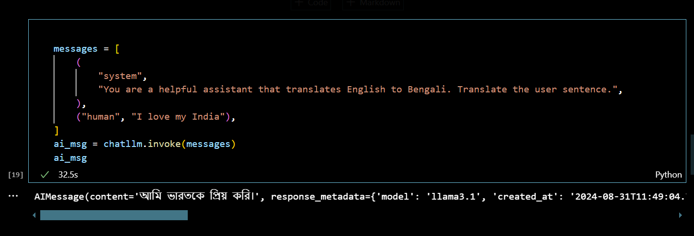
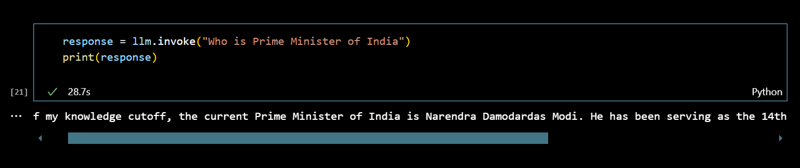
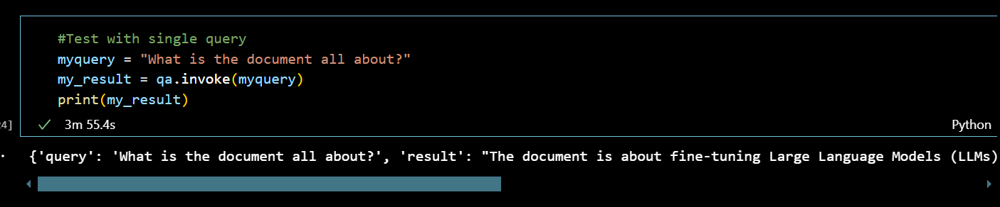
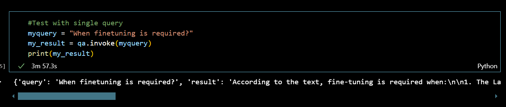
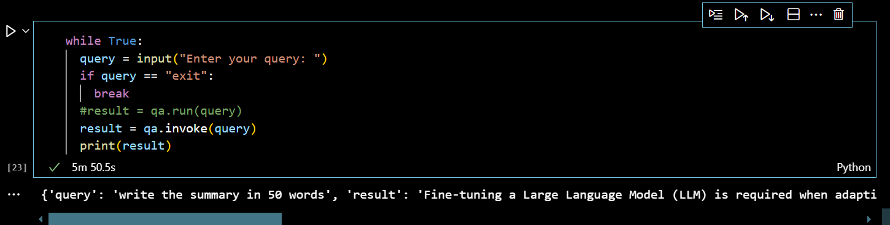

# RAG-using-Llama-3.1
!! This simple project is just for learning purpose !!

My Aim is to create a simple RAG application which will answer questions from pdf which I have uploaded.
Here I have written a blog on "Finetuning LLMs: When, Why, and Alternatives" and It is in pdf format. The file name is "Finetuning_LLMs.pdf". I will write few query and it will answer from my uploaded pdf.

Steps to be followed:
1. Install Llama3.1 on your system. For reference please check: https://python.langchain.com/v0.2/docs/tutorials/llm_chain/
2. I am doing all these task on VS code. So I have created a virtual envirinment with python==3.9

3. Install all the libraries and Packages mentioned in "requirements.txt"
4. RAG is build in 3 Steps:
    a. Data Ingestion
    b. Data Retrival
    c. Data Generation
5. Import all the required libraries using langchain
6. Data Ingestion: Load Document/pdf using PyPDFLoader document loader. For reference: https://python.langchain.com/v0.2/docs/integrations/document_loaders/
7. Chunking: Splitting the data into small chunks
8. Embedding: load the Hugging Face Embedding class using command from langchain_huggingface import HuggingFaceEmbeddings. For reference check: https://python.langchain.com/v0.2/docs/integrations/text_embedding/huggingfacehub/
9. Load the data and corresponding embedding into FAISS. For reference: https://python.langchain.com/v0.2/docs/integrations/vectorstores/faiss_async/
10. Persist the vectors locally on disc with name "faiss_index_"
11. Create a retriever on the top of vectorDB.
12 Load Data to LLM
13. Invoke the model to generate response for any general question.
14. Used RetrievalQA chain for orchestration
15. Test with single queries and It provides answers from the uploaded document.
16. I have written the code to get user query answer as well.

Completed.

Outputs:

